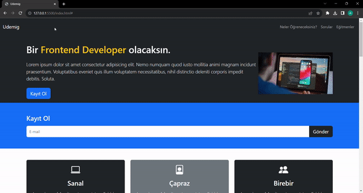

<h1>Udemig Web Site</h1>

This project is a software course website.

<h2>Content</h2>

<ul>

<li>Showcase</li>
<li>Contact</li>
<li>Education Types</li>
<li>Learn Types</li>
<li>Mostly Asked Questions</li>
<li>Instructors</li>
<li>Contact</li>

</ul>

<h2>Used Technologies</h2>

<ul>

<li>HTML</li>
<li>HTML5</li>
<li>CSS</li>
<li>Bootstrap</li>

</ul>

<h1>Screen Gif</h1>

